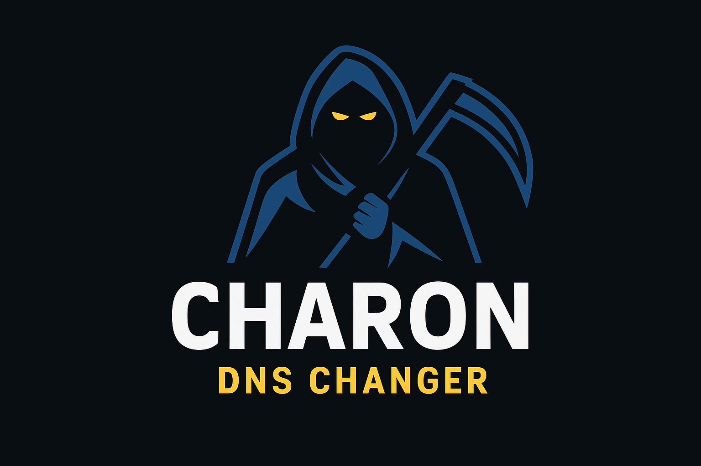

<head>
  <meta name="google-site-verification" content="l4gzIHopgDDt57xRYeRvJZ5DYgg4lLb-qPciUxhNxkY" />
</head>

<div align="center">
  
  <h1>Charon DNS Changer</h1>
  
  
  
  <br>
  <br>
  <p><code><strong>Charon DNS Changer</strong></code> is a powerful cross-platform tool designed to simplify DNS management on Windows and Linux. It allows users to view current DNS settings, switch between predefined DNS servers, set custom primary and secondary DNS addresses, and easily restore automatic DHCP configuration. With built-in validation, backup support, and an interactive menu, it ensures secure and efficient DNS configuration for both casual users and advanced system administrators</p>
</div>


## Project Programmer

> Ch4120N - Ch4120N@Proton.me

## Made For

> Anyone who wants an easy, cross-platform solution to manage, customize, and restore DNS settings on Windows and Linux — from casual users to system administrators

## 👀 Screenshot


## ⚓ Requires

> Python3

### Installing Requirement Packages

> python -m pip install -r requirements.txt

## ⚙️ Installation

### For Linux

```bash
sudo apt install python3 git -y
git clone https://github.com/Ch4120N/Charon-DNS-Changer.git
chmod 755 -R Charon-DNS-Changer
cd Charon-DNS-Changer
python3 -m pip install -r requirements.txt
python3 ChDNSChanger.py
```

### For Windows

If you have Git on your computer, you can use this installation guide:

```batch
git clone https://github.com/Ch4120N/Charon-DNS-Changer.git
cd Charon-DNS-Changer
python -m pip install -r requirements.txt
python ChDNSChanger.py
```

Otherwise, you can download the zip file from this [link](https://github.com/Ch4120N/Charon-DNS-Changer/releases), extract it, and use it.

## Supported Operating Systems

- [x] Debian
- [x] Kali Linux
- [x] Ubuntu
- [x] Windows 7/8/10/11

## ✨ Features

- Cross-Platform Support
- Interactive Menu
- View Current DNS
- Predefined DNS Options
- Custom DNS Setup
- Reset to DHCP
- Backup & Restore
- Primary Network Detection (Windows)
- Admin/Root Check
- Colorful & Informative Output
- Advanced Error Handling
- Easy Extensibility

## ❤️ Donation

> bitcoin: bc1ql4syps7qpa3djqrxwht3g66tldyh4j7qsyjkq0

## 🚨 Reporting Issues

If you are facing a configuration issue or something is not working as you expected to be, please use the **Ch4120N@Proton.me**
