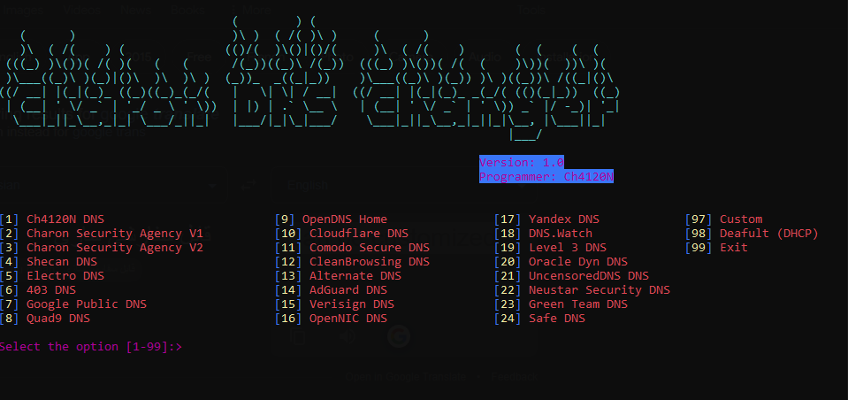

<head>
  <meta name="google-site-verification" content="l4gzIHopgDDt57xRYeRvJZ5DYgg4lLb-qPciUxhNxkY" />
</head>

# Charon DNS Changer V1.0

## Project Programmer
> Ch4120N - Ch4120ni@Gmail.com

## Made For
> Changing DNS Very Easy (I had the same problem that I had to go to the `Network and Sharing Center`)

## 👀 Screenshot


## ⚓ Requires
> Python3
> 
> pip install -r requirements.txt

## ⚙️ Installation

```bash
sudo apt install python3-full python-is-python3 git -y
git clone https://github.com/Ch4120N/Charon-DNS-Changer-V1.0
chmod 755 -R Charon-DNS-Changer-V1.0
cd Charon-DNS-Changer-V1.0
python -m pip install -r requirements.txt
python chdnschanger.py
```
If you using `Kali Linux` remove python-is-python3 from line 1.

## Supported Operating Systems
- [X] Debian
- [X] Kali Linux
- [X] Ubuntu
- [X] Windows 7/8/10/11

## ✨ Features

* Very Simple
* Can Be Customized
* Good Design
* Very High Speed
* Advanced Error Handling

## ❤️ Donation 
> bitcoin:   bc1ql4syps7qpa3djqrxwht3g66tldyh4j7qsyjkq0

## 🚨 Reporting Issues

If you are facing a configuration issue or something is not working as you expected to be, please use the **Ch4120ni@Gmail.com**
